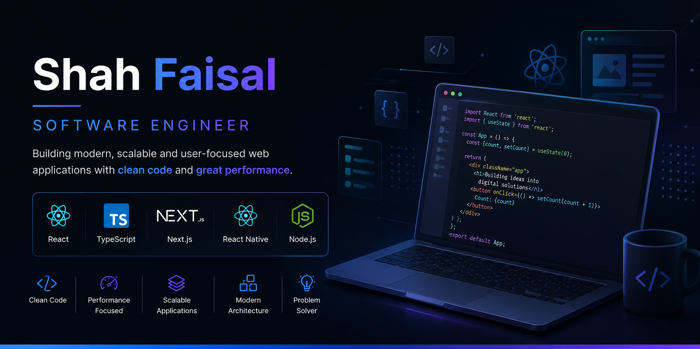

  

<h1 align="center">Hi 👋, I'm Shah Faisal</h1>

<h3 align="center">
Software Engineer • React • TypeScript • Next.js • React Native
</h3>

I build scalable, modern, and responsive web applications with a strong focus on clean UI, performance, and user experience.

---

## 👨‍💻 About Me

- 💼 3.5+ years of professional software development experience
- ⚛️ Specialized in React, TypeScript, Next.js and React Native
- 🚀 Experienced in building production-grade dashboards and SaaS products
- 📊 Built data-intensive applications using OpenSearch Dashboards
- 🔥 Passionate about reusable components, performance optimization and clean architecture
- 🌱 Currently exploring advanced React, AI integrations and modern frontend architecture

---

## 🚀 Tech Stack

### Frontend

### Backend

### Tools

Git • GitHub • Cypress • REST APIs • OpenSearch • Linux • Figma • VS Code

---

# 🌟 Featured Projects

## 📚 Exam Management Application
A modern React + TypeScript application for managing online examinations.

✔ CRUD Operations

✔ REST API Integration

✔ Modern UI

---

## 🏥 Healthcare Dashboard

A professional dashboard built with:

- React
- TypeScript
- Redux Toolkit
- Firebase
- Recharts

Includes analytics, authentication, dashboards and reusable components.

---

## 🖼 Gallery Web App

Responsive image gallery with modern UI and optimized performance.

---

## 📱 Pets Gallery App

Native Android application developed using Kotlin.

Features:

- Search
- Sorting
- Image download
- Local storage

---

## 🎮 Name Predictor React Native

Interactive React Native game with smooth navigation, reusable components and modern UI.

---

## 💻 Modern Portfolio

A glassmorphism-inspired developer portfolio showcasing responsive design and modern UI trends.

---

# 📈 GitHub Stats

---

## 📫 Connect with Me

- 💼 LinkedIn: https://www.linkedin.com/in/shah-faisal-ba4a71212/
- 📧 Email: shahf6738@gmail.com
- 🌐 Portfolio: https://shahfaisalahmad.netlify.app/

---

⭐ Thanks for visiting my profile!

